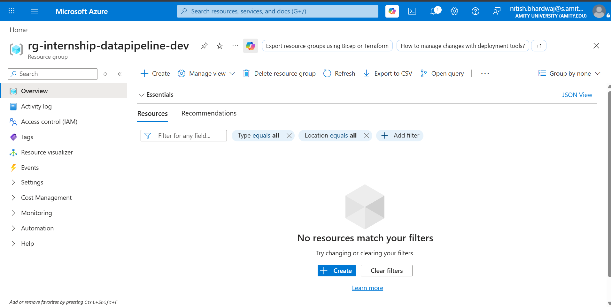
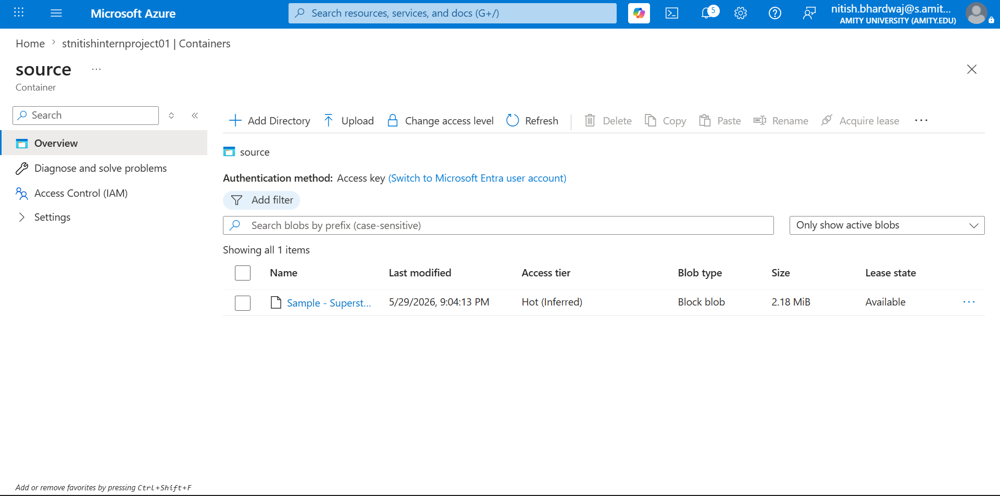
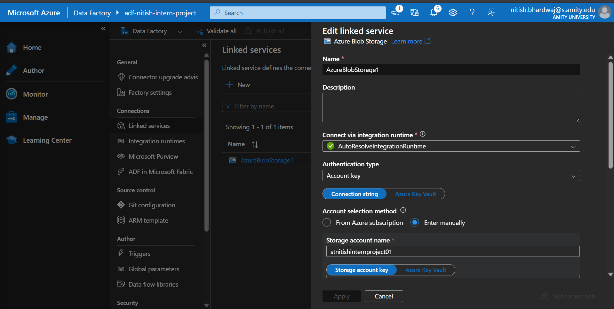
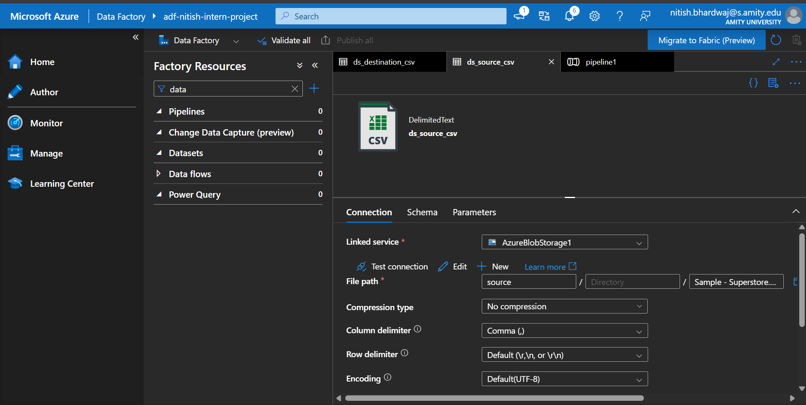
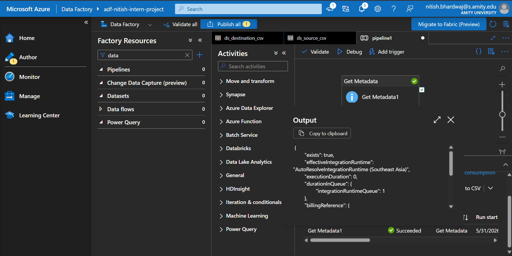
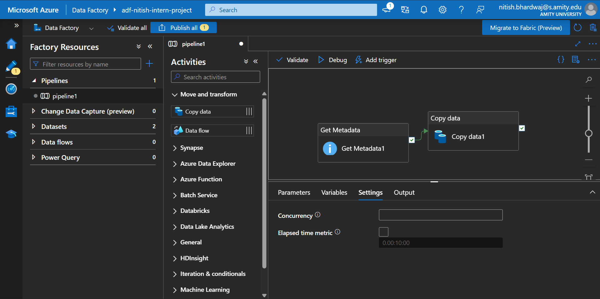
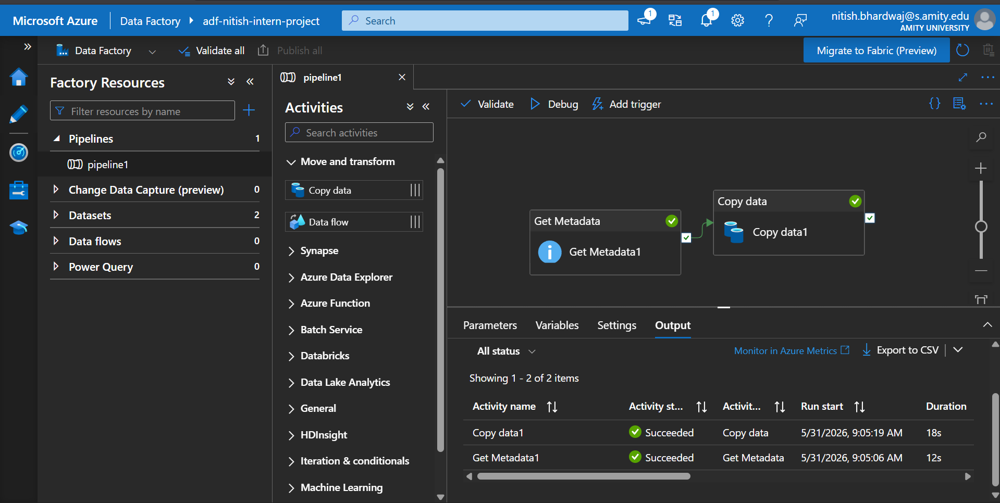
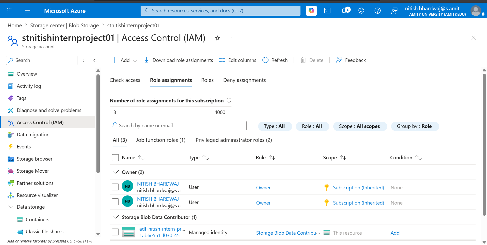

# Azure Cloud Fundamentals & Data Pipeline Implementation (Week 4 Assignment)

## Project Objective
To design, deploy, and execute an automated cloud data pipeline using Microsoft Azure. This project validates fundamental cloud engineering principles, metadata validation practices, security identity controls (IAM), and automated extraction workflows using Azure Data Factory (ADF).

---

## Environment Configuration & Architecture
*   **Resource Group:** `rg-internship-datapipeline-dev`
*   **Storage Account:** `stnitishinternproject01` (Standard performance, LRS redundancy)
*   **Storage Isolation Layers:** 
    *   `/source` - Serving as the raw landing zone for file arrival.
    *   `/destination` - Serving as the staging destination folder for pipeline output.
*   **Orchestration Engine:** `adf-nitish-intern-project` (Data Factory V2 framework).

---

## Technical Proof of Deliverables

### Task 1: Environment Provisioning
Logical administrative grouping initialized successfully within the target cloud subscription deployment boundaries.

### Task 2: Storage Infrastructure Setup
Primary storage resources created with an unstructured data tracking file successfully staged inside the operational grid.

### Task 3: Azure Data Factory Foundations
#### Linked Service
Secure API pipeline integration established targeting the primary storage account tier.

#### Dataset Configuration
Abstracted structural references mapped to isolate storage endpoints for schema operations.

#### Get Metadata Handler Evaluation
Execution validation check successfully returning a true metadata query string confirming target document health.

### Task 4 & 5: Pipeline Design & Verified Success Runtime
The final data-engineering architecture pipeline map displaying validation layers wired onto ingestion logic handlers.

#### Execution Results
System log confirming an automated batch copy run resulting in errorless deployment completion across all steps.

### Task 6: Identity and Access Management (IAM Role Assignment)
Enforced platform access constraints by granting the native cloud security role `Storage Blob Data Contributor` to the ADF Managed Identity.

---

## Assignment Performance Summary
1. **Metadata Verification Controls:** Utilizing a `Get Metadata` handler acts as an architectural guardrail, stopping downstream copy failures before consuming cloud processing costs.
2. **Credentialless RBAC Security:** Binding explicit cloud directory roles straight onto a Managed Service Identity ensures optimal ecosystem security compliance.
3. **Pipeline Orchestration:** Proved end-to-end functionality by pulling from raw file stores, processing via metadata dependencies, and safely transforming records to modern targets.
